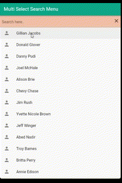
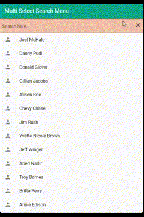
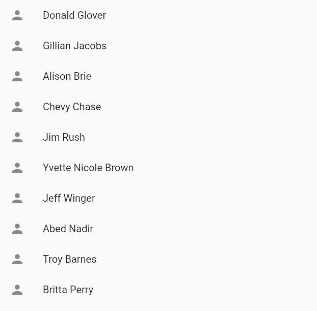
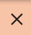
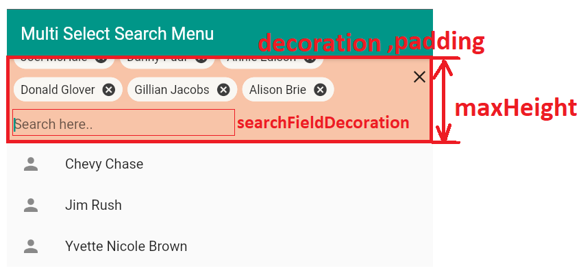
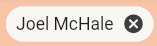

<!--
This README describes the package. If you publish this package to pub.dev,
this README's contents appear on the landing page for your package.

For information about how to write a good package README, see the guide for
[writing package pages](https://dart.dev/guides/libraries/writing-package-pages).

For general information about developing packages, see the Dart guide for
[creating packages](https://dart.dev/guides/libraries/create-library-packages)
and the Flutter guide for
[developing packages and plugins](https://flutter.dev/developing-packages).
-->

Easily buildable and customizable multi select widget with search field that can be used anywhere from container to dialog.

 

## Features

- Can be used in any Flutter widget. Wrap it in Container, dialog, bottom modal sheet etc.
- User can search from your list of items.
- Selected item chips list, search field, selectable item list are all visible in one.
- List items are not hard-coded. You make your own list item widgets.
- `onChanged` method returns a list of selected items every time user selects/unselect an item.

## Getting started

To start using the package, add the dependencies in your pubspec.yaml and import.
## Usage

1. First, you need a list of items from same Class. 
   Your class model **MUST** have `fromJson` & `toJson` method.

```dart
var list = [
      Contact(1, "Joel McHale"),
      Contact(2, "Danny Pudi"),
      Contact(3, "Donald Glover"),
      Contact(4, "Gillian Jacobs"),
      Contact(5, "Alison Brie"),
      Contact(6, "Chevy Chase"),
      Contact(7, "Jim Rush"),
      Contact(8, "Yvette Nicole Brown"),
      Contact(9, "Jeff Winger"),
      Contact(10, "Abed Nadir"),
      Contact(11, "Troy Barnes"),
      Contact(12, "Britta Perry"),
      Contact(13, "Annie Edison"),
    ];

class Contact {
  final int id;
  final String name;

  Contact(
    this.id,
    this.name,
  );

  Contact.fromJson(Map<String, dynamic> json)
      : id = json['id'],
        name = json['name'];

  Map<String, dynamic> toJson() {
    return {
      'id': id,
      'name': name,
    };
  }
}
```

2. Now you are ready to use the `MultiSelectSearch` widget.
   - `itemBuilder`
    : Build your own list item widgets to select from.

    

   - `chipLabelKey`
    : A field name of your class that should be displayed in selected item chip. In this example, we're displaying Contact's name field value in chip when selected. So it's `'name'`

   - `items` 
    : The list you created in step 1. Both items and itemBuilder must use the same list.

   - `initialValue`
    : Some of your list items to be selected beforehand.

   - `onChanged`
    : Returns the selected item list everytime a user selects/unselects an item.

   - `clearAll`
    : A widget to clear all selected items when clicked. Do not use button widgets.

    

```dart
MultiSelectSearch<Contact>(
    itemBuilder: (Contact item) => ListTile(
        key: ObjectKey(item),
        leading: const Icon(Icons.person),
        title: Text(item.name),
    ),
    chipLabelKey: 'name',
    items: list,
    initialValue: initial,
    onChanged: (List<Contact> items) =>
        setState(() => selectedItems = items),
    decoration: BoxDecoration(
        color: const Color(0xFFF7A072).withOpacity(0.6),
        border: const Border(
            bottom: BorderSide(color: Colors.grey),
        ),
    ),
    clearAll: const Padding(
        padding: EdgeInsets.only(top: 10.0, right: 6.0),
        child: Icon(Icons.clear),
    ),
),
```

3. To customize some styles:
   
   - `maxHeight`: Search field & selected items container's maximum height when it's expanded.

   - `decoration`: Search field & selected items container decoration

   - `padding`: Search field & selected items container padding
  
   - `searchFieldDecoration`: `InputDecoration` to change search field's style, hint text and more.
    
   

   - Selected item chip gets its style from the theme. In order to customize it, change `chipThemeData` in your AppTheme

   ```
   theme: ThemeData(
        primarySwatch: Colors.teal,
        chipTheme: const ChipThemeData(
          deleteIconColor: Color.fromARGB(255, 61, 61, 61),
          backgroundColor: Color(0xFFF9F7F3),
        ),
      ),
   ``` 

   

## Additional information

Feel free to create issue for any bugs or requests.
